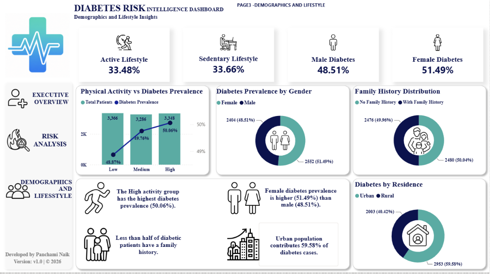

  

<h1 align="center">Hi 👋, I'm Panchami Naik</h1>

  

---

## 👩‍💻 About Me

I'm an aspiring **Data Analyst** passionate about transforming raw data into meaningful business insights.

- 📊 Power BI Dashboard Developer
- 📈 SQL & Excel Enthusiast
- 🐍 Learning Python for Analytics
- 🚀 Building real-world Data Analytics projects
- 💼 Open to Data Analyst opportunities

---

## 🛠 Tech Stack

---

## 🚀 Featured Project

### 🏥 Diabetes Risk Intelligence Dashboard

An interactive healthcare analytics dashboard built with **Power BI**, **DAX**, **Power Query**, and **SQL** to analyze diabetes risk factors and support data-driven healthcare decisions.

### 🔍 Key Features

- 📊 Executive KPI Dashboard
- 👥 Demographic Analysis
- ❤️ Lifestyle Risk Analysis
- 📈 Interactive Charts
- ⚡ Advanced DAX Measures
- 📑 Power Query Data Transformation
- ## 📷 Dashboard Preview

  

## 💻 Skills

| Category | Technologies |
|----------|--------------|
| BI Tools | Power BI |
| Languages | SQL, Python |
| Data | Excel, Power Query |
| Visualization | DAX, Power BI |
| Version Control | Git, GitHub |

### 📚 Book Web Scraping & Data Analysis

> A complete Python data analytics workflow — from **web scraping → data cleaning → EDA → visualization → insights**.

| 🔍 Project | 🛠️ Technologies | 📊 Focus |
|---|---|---|
| 📚 Book Web Scraping & Data Analysis | Python, BeautifulSoup, Pandas, Matplotlib | Web Scraping • EDA • Data Visualization |

  

**Highlights**
- 🌐 Collected **1,000 book records**
- 🧹 Cleaned and prepared the dataset for analysis
- 🔍 Identified **999 unique book titles**
- 📊 Analyzed rating and price distributions
- 📈 Explored the relationship between book price and rating
- 🖼️ Created multiple data visualizations

🔗 **[📂 View Project](https://github.com/Panchaminaik/book-web-scraping-data-analysis)**
## 💼 Open to Work

I'm actively looking for opportunities as a **Data Analyst** where I can apply my skills in:

- Power BI
- SQL
- Excel
- Python
- Business Intelligence

## 📫 Connect With Me

---

> "Without data, you're just another person with an opinion." — W. Edwards Deming
